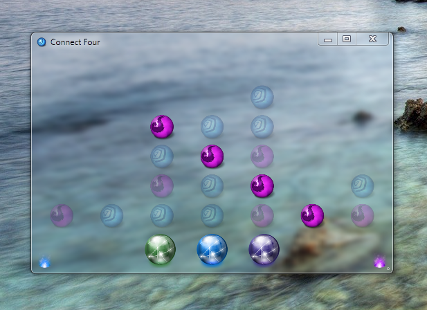
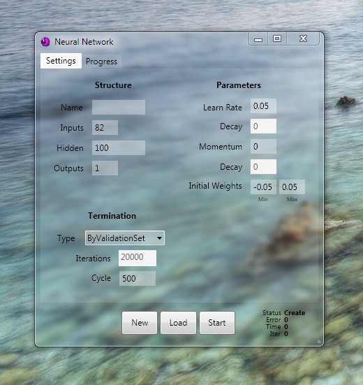
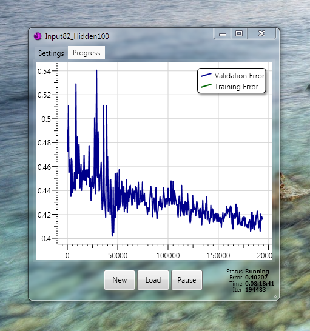

Connect Four Neural Network
===============

**Abstract**

Various reinforcement learning techniques were applied to the game of Connect Four to develop a viable artificial agent that was shown to perform well against human players.  Utilizing a back-propagation neural network able to adjust momentum and learning rates on the fly, these techniques were taken from the temporal difference class of methods and applied to the game.  Training was accomplished by a neural network engaged in self-play, where board states represented the input to the structure, and outputs computed were a prediction of future result of the game assuming perfect play thereafter.  Testing was performed on a validation set composed of an optimal board database of all 8-ply positions and their theoretical results.  The performance was measured using an L2 Error Norm, namely, root mean squared error (RMSE) to analyze the neural network’s prediction power and how this differed from the true theoretical results.  Additional techniques were explored in an effort to lower error rates.  These included using a MiniMax algorithm and probability distributions to guide move selection and adding additional feature detectors in addition to using only the board state.  The best root mean squared error found was .37324 compared to purely randomized game play, which yielded error rates of around .5 to .6.  Though the error rate is only a modest .37324, it was shown to perform well enough to beat an intelligent human player with an average win loss ratio of 8:1.     

**Files**

- [Final Paper](Documents/Final Report - Connect Four.docx)
- [Final Paper (pdf)](Documents/Final Report - Connect Four.pdf)
- [Results](Results)
- [Release](Release.7z)

**Screenshots**

---

---

---

---

